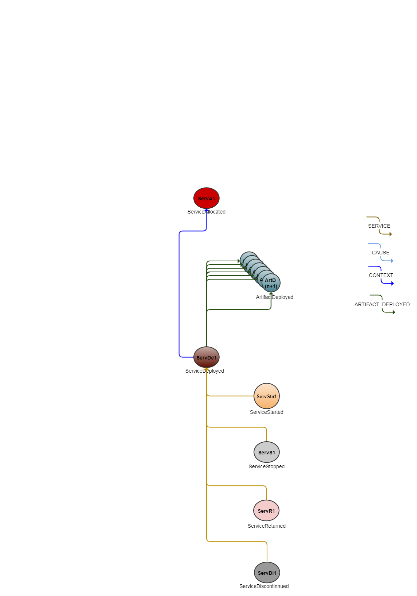

<!---
   Copyright 2017 Ericsson AB.
   For a full list of individual contributors, please see the commit history.

   Licensed under the Apache License, Version 2.0 (the "License");
   you may not use this file except in compliance with the License.
   You may obtain a copy of the License at

       http://www.apache.org/licenses/LICENSE-2.0

   Unless required by applicable law or agreed to in writing, software
   distributed under the License is distributed on an "AS IS" BASIS,
   WITHOUT WARRANTIES OR CONDITIONS OF ANY KIND, either express or implied.
   See the License for the specific language governing permissions and
   limitations under the License.
--->

# Artifact deployment lifecycle Example
 
This example discusses how the traceability of an artifact's deployment lifecycle can be implemented using Eiffel events.
 
Introduction
To understand the lifecycle of an artifact we must go back and start at the source.
The origins of an artifact begin with the first checkin of code. Over time multiple commits & mergers culminate in the first built version of an artifact.
This new artifact then goes through testing to ensure that the desired functionality and quality level etc,.of the artifact has been achieved.
Once this has been established the artifact is released and deployed into Operations where it lives until it is replaced by another version and then finally it is discontinued from use altogether.
Having the capability to track & trace the entire lifecycle of artifacts is highly desirable in a CI/CD context.
In the context of continuous deployment, track and trace may be achieved by employing events such as EiffelServiceDeployedEvent, EiffelArtifactDeployedEvent & EiffelServiceStartedEvent.

## Event Graph

# Event-by-Event Explanation

# ServDe1
EiffelServiceDeployedEvent ServDe1 in this example representing a Service Instance (e.g VM) has been deployed.

# ActT1
EiffelActivityTriggeredEvent ArtT1 in this example representing activities performed by an Orchestrator/resource scheduler.
Using its CAUSE link, the EiffelActivityTriggeredEvent ActT1 declares that it is CAUSED by EiffelServiceDeployedEvent ServDe1.

# ArtD1
EiffelArtifactDeployedEvent ArtD1 in this example representing an artifact has been deployed into the Service Instance.
Using its CAUSE link, the EiffelArtifactDeployedEvent ArtD1 declares that it is CAUSED by EiffelActivityTriggeredEvent ActT1

# ActT2
EiffelActivityTriggeredEvent ActT2, in this example representing activities performed by an entity.
Using its CAUSE link, the EiffelActivityTriggeredEvents ActT2 declares that is CAUSED by EiffelArtifactDeployedEvent ArtD1.

# ServDe2
EiffelServiceDeployedEvent ServDe2 in this example representing a Service has been deployed.
Using its CAUSE link, the EiffelServiceDeployedEvent ServDe1 declares that is CAUSED by EiffelActivityTriggeredEvent ActT2.

# ActT3
EiffelActivityTriggeredEvent ActT3 in this example representing activities performed by an entity.
Using its CAUSE link, the EiffelActivityTriggeredEvents ActT3 declares that is CAUSED by EiffelServiceDeployedEvent ServDe1.

# ServSta1
EiffelServiceStartedEvent ServSra1 in this example representing a Service has been started.
Using its CAUSE link, the EiffelServiceStartedEvent ServSta1 declares that it is CAUSED by EiffelActivityTriggeredEvents ActT3.
